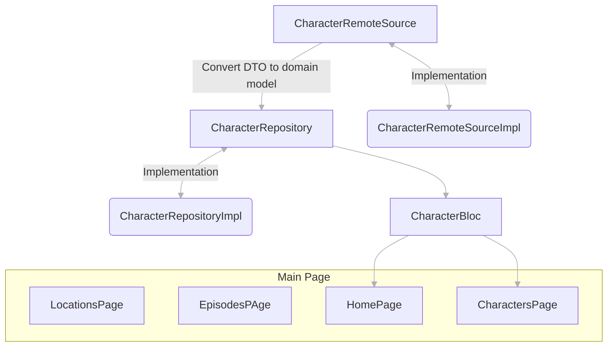

# rick_and_morty_flutter

run this before building app:
```
flutter pub global activate build_runner
flutter pub run build_runner build
```


## Tech Stack

1.[Go Router](https://pub.dev/packages/go_router) used for navigation

2.[go_router_builder](https://pub.dev/documentation/go_router/latest/topics/Type-safe%20routes-topic.html) used for type safe navigations

3.[flutter bloc](https://bloclibrary.dev/#/) used as state management library


## Architecture




### Todo:

1.I manually parse json to dart classes just for playing with dart in future i will use [Json serializable](https://pub.dev/packages/json_serializable)
2.Add search bar for search between characters
3.Create view for episodes
4.Create view for locations
